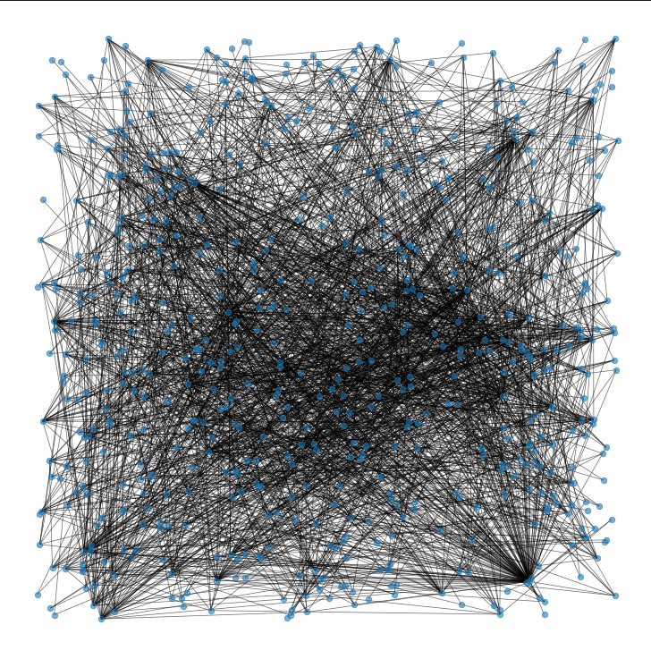

# graph_data
Visualizing and creating ML model for graph data

- Using node2Vec (word2Vec equivalent with random walk) for graph embeddings

## Highlights

### Graph viz

 
 

### PCA of graph node embeddings with knn

 
 

### ROC for classifier

 
 

### P-R curve for classifier

